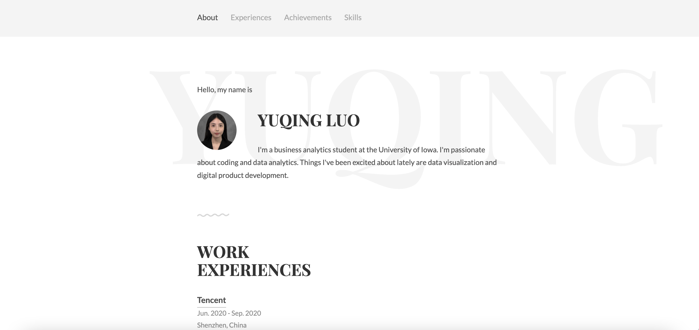

# Portfolio Website

     

## Table of Contents
* [General Info](#general-information)
* [Setup](#setup)
* [Usage](#usage)
* [Project Status](#project-status)
* [Acknowledgements](#acknowledgements)
<!-- * [License](#license) -->

## General Information
- This is a digital product management course assignment.
- The purpose of the assignment is to create a portfolio website.
- To view my portfolio site, please go to this link https://yuqingluo.com/
<!-- You don't have to answer all the questions - just the ones relevant to your project. -->

## Setup
What are the project requirements/dependencies? Where are they listed? A requirements.txt or a Pipfile.lock file perhaps? Where is it located?

Proceed to describe how to install / setup one's local environment / get started with the project.

## Usage
Provide various use cases and code examples here.

`write-your-code-here`

## Project Status
Project is: _complete_ 

## Acknowledgements
The project was based on the template created by Afnizar Nur Ghifari.(https://github.com/afnizarnur/draco).

<!-- Optional -->
<!-- ## License -->
<!-- This project is open source and available under the [... License](). -->

<!-- You don't have to include all sections - just the one's relevant to your project -->
